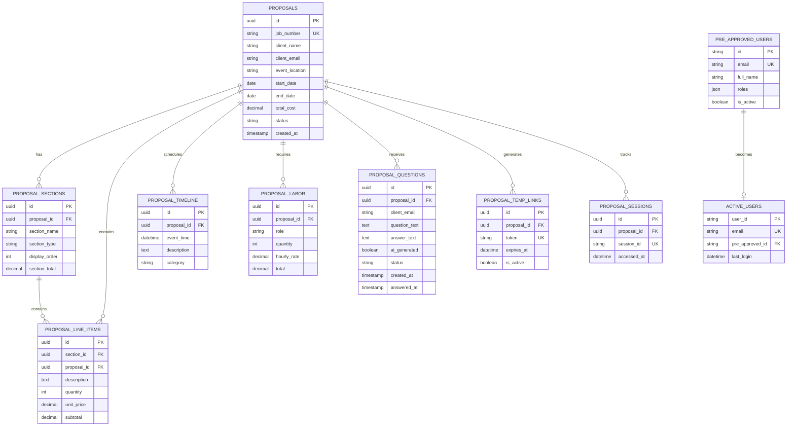

# Architecture Diagrams (Mermaid Code)

This document contains architecture diagrams as code using Mermaid syntax. These diagrams can be rendered in GitHub, GitLab, VS Code, and other Markdown viewers.

## Table of Contents
1. [System Context Diagram (C4 Level 1)](#1-system-context-diagram-c4-level-1)
2. [Container Diagram (C4 Level 2)](#2-container-diagram-c4-level-2)
3. [Component Diagram (C4 Level 3)](#3-component-diagram-c4-level-3)
4. [Deployment Architecture](#4-deployment-architecture)
5. [RAG Question Flow Sequence](#5-rag-question-flow-sequence)
6. [Auto-Scaling State Machine](#6-auto-scaling-state-machine)
7. [Database Entity Relationship](#7-database-entity-relationship)
8. [AWS Infrastructure](#8-aws-infrastructure)

---

## 1. System Context Diagram (C4 Level 1)

Shows how the system fits into the broader ecosystem.


---

## 2. Container Diagram (C4 Level 2)

Shows the high-level technical architecture.


---

## 3. Component Diagram (C4 Level 3)

Shows the internal components of the FastAPI application.

```mermaid
C4Component
    title Component Diagram - FastAPI Application

    Container_Boundary(fastapi, "FastAPI Application") {
        Component(router, "API Router", "FastAPI Router", "Route definitions and middleware")

        Component(auth, "Auth Module", "Python", "JWT validation, Cognito integration")
        Component(proposals, "Proposal Service", "Python", "Proposal CRUD operations")
        Component(questions, "Question Service", "Python", "Q&A management")
        Component(users, "User Service", "Python", "User management")
        Component(email, "Email Service", "Python", "SMTP email notifications")

        Component_Boundary(rag_boundary, "RAG Service") {
            Component(classifier, "Question Classifier", "Python", "Categorizes questions")
            Component(embedder, "Embedding Generator", "Sentence Transformers", "Creates vector embeddings")
            Component(faiss, "Vector Search", "FAISS", "Semantic similarity search")
            Component(claude, "Claude Client", "Anthropic SDK", "AI answer generation")
        }

        Component(models, "SQLAlchemy Models", "ORM", "Database models")
        Component(config, "Configuration", "Pydantic Settings", "Environment config")
    }

    ComponentDb_Ext(db, "PostgreSQL", "Database", "Data persistence")
    System_Ext(claude_api, "Claude API", "External AI service")

    Rel(router, auth, "Validates", "Python")
    Rel(router, proposals, "Calls", "Python")
    Rel(router, questions, "Calls", "Python")
    Rel(router, users, "Calls", "Python")

    Rel(questions, classifier, "Classifies question", "Python")
    Rel(questions, embedder, "Generates embedding", "Python")
    Rel(questions, faiss, "Searches vectors", "Python")
    Rel(questions, claude, "Gets AI answer", "Python")

    Rel(proposals, models, "Uses", "Python")
    Rel(questions, models, "Uses", "Python")
    Rel(users, models, "Uses", "Python")
    Rel(models, db, "Queries", "SQL")

    Rel(claude, claude_api, "API call", "HTTPS")
    Rel(router, config, "Reads", "Python")
```

---

## 4. Deployment Architecture

Shows how the system is deployed on AWS infrastructure.


---

## 5. RAG Question Flow Sequence

Shows the detailed flow of a RAG-enabled question from submission to answer.


---

## 6. Auto-Scaling State Machine

Shows how the auto-scaling system responds to load.


---

## 7. Database Entity Relationship

Shows the database schema relationships.



---

## 8. AWS Infrastructure

Shows the complete AWS infrastructure components.


---

## Usage Instructions

### View in GitHub
Simply view this file on GitHub - Mermaid diagrams render automatically.

### View in VS Code
Install the "Markdown Preview Mermaid Support" extension:
```bash
code --install-extension bierner.markdown-mermaid
```

### Export as Images
Use the Mermaid CLI:
```bash
# Install mermaid-cli
npm install -g @mermaid-js/mermaid-cli

# Export diagrams
mmdc -i ARCHITECTURE_DIAGRAMS.md -o output.png
```

### View Online
Copy any diagram code block to: https://mermaid.live/

### Customize
Edit the Mermaid code blocks and adjust:
- Colors using `style` commands
- Layout using `UpdateLayoutConfig`
- Text and labels
- Relationships and flows

---

## Diagram Legend

### C4 Diagrams
- **Person**: Human user (customer, admin)
- **System**: Software system
- **Container**: Deployable unit (service, database)
- **Component**: Code component (module, class)

### Graph Diagrams
- **Solid arrows**: Data/control flow
- **Dashed arrows**: Monitoring/logging
- **Colored boxes**: Logical groupings

### Sequence Diagrams
- **Timeline**: Top to bottom = time progression
- **Actors**: Users or external systems
- **Participants**: System components
- **Messages**: Interactions between components

---

**Generated**: 2025-12-05
**Version**: 1.0
**Format**: Mermaid v10+
**Maintainer**: Pinnacle Development Team
