# Pinnacle SSO Backend - Use Case Diagram

## Overview
This document contains a comprehensive use case diagram showing all actors, use cases, and their relationships in the Pinnacle SSO Backend system.

---

## Complete Use Case Diagram

```mermaid
graph TB
    %% ============================================
    %% ACTORS
    %% ============================================
    Client[👤 Event Client]
    GuestClient[👤 Guest Client]
    Admin[👨‍💼 Administrator]
    SalesPerson[👨‍💼 Sales Person]
    SysAdmin[👨‍🔧 System Admin]

    %% External Systems
    ClaudeAI[🤖 Claude AI]
    Cognito[🔐 AWS Cognito]
    EmailSys[📧 Email System]
    Database[💾 Database System]

    %% ============================================
    %% CLIENT USE CASES
    %% ============================================
    ViewProposal[View Proposal Details]
    BrowseProposals[Browse Proposals]
    AskQuestion[Ask Question]
    ViewAnswer[View AI Answer]
    ViewQA[View Q&A History]
    AcceptTerms[Accept Terms & Conditions]
    DownloadProposal[Download Proposal PDF]
    AccessSecureLink[Access via Secure Link]
    ViewTimeline[View Event Timeline]
    ViewPricing[View Pricing Breakdown]
    ContactSales[Contact Sales Team]

    %% ============================================
    %% AUTHENTICATION USE CASES
    %% ============================================
    Login[Login/Logout]
    Register[Register Account]
    SSOLogin[SSO Login via Cognito]
    ValidateToken[Validate JWT Token]
    GenerateTempLink[Generate Temporary Link]

    %% ============================================
    %% SALES PERSON USE CASES
    %% ============================================
    CreateProposal[Create New Proposal]
    EditProposal[Edit Proposal]
    ManageProposals[Manage Proposals]
    AddLineItems[Add Equipment/Line Items]
    ConfigureSections[Configure Sections]
    SetPricing[Set Pricing & Discounts]
    AnswerQuestions[Answer Client Questions]
    ReviewAIAnswers[Review AI Answers]
    SendProposal[Send Proposal to Client]
    TrackProposalStatus[Track Proposal Status]
    ManageLabor[Manage Labor Costs]
    SetTimeline[Set Event Timeline]

    %% ============================================
    %% ADMIN USE CASES
    %% ============================================
    ManageUsers[Manage Users]
    ApproveUsers[Approve User Access]
    ViewAnalytics[View Analytics Dashboard]
    ManageQuestions[Manage All Questions]
    ViewReports[View Sales Reports]
    ExportData[Export Data]
    ManageClients[Manage Client Database]
    ConfigureSettings[Configure System Settings]
    ViewAuditLog[View Audit Logs]

    %% ============================================
    %% SYSTEM ADMIN USE CASES
    %% ============================================
    ConfigureRAG[Configure RAG Settings]
    ManageAPIKeys[Manage API Keys]
    MonitorSystem[Monitor System Health]
    ManageDatabase[Manage Database]
    ConfigureEmail[Configure Email Service]
    ViewSystemLogs[View System Logs]
    ManageBackups[Manage Backups]
    ScaleResources[Scale AWS Resources]

    %% ============================================
    %% AI/RAG USE CASES
    %% ============================================
    ClassifyQuestion[Classify Question Complexity]
    GenerateEmbedding[Generate Question Embedding]
    SemanticSearch[Perform Semantic Search]
    GenerateAIAnswer[Generate AI Answer]
    CacheVectorStore[Cache Vector Store]

    %% ============================================
    %% SYSTEM USE CASES
    %% ============================================
    AuthenticateUser[Authenticate User]
    SendNotification[Send Email Notification]
    ProcessPayment[Process Payment]
    GenerateInvoice[Generate Invoice]
    TrackSession[Track User Session]
    RateLimiting[Apply Rate Limiting]

    %% ============================================
    %% CLIENT CONNECTIONS
    %% ============================================
    Client --> ViewProposal
    Client --> AskQuestion
    Client --> ViewAnswer
    Client --> ViewQA
    Client --> AcceptTerms
    Client --> DownloadProposal
    Client --> ViewTimeline
    Client --> ViewPricing
    Client --> ContactSales
    Client --> Login
    Client --> Register

    GuestClient --> AccessSecureLink
    GuestClient --> ViewProposal
    GuestClient --> AskQuestion
    GuestClient --> DownloadProposal

    %% ============================================
    %% SALES PERSON CONNECTIONS
    %% ============================================
    SalesPerson --> CreateProposal
    SalesPerson --> EditProposal
    SalesPerson --> ManageProposals
    SalesPerson --> AddLineItems
    SalesPerson --> ConfigureSections
    SalesPerson --> SetPricing
    SalesPerson --> AnswerQuestions
    SalesPerson --> ReviewAIAnswers
    SalesPerson --> SendProposal
    SalesPerson --> TrackProposalStatus
    SalesPerson --> ManageLabor
    SalesPerson --> SetTimeline
    SalesPerson --> Login
    SalesPerson --> ViewAnalytics

    %% ============================================
    %% ADMIN CONNECTIONS
    %% ============================================
    Admin --> ManageUsers
    Admin --> ApproveUsers
    Admin --> ViewAnalytics
    Admin --> ManageQuestions
    Admin --> ViewReports
    Admin --> ExportData
    Admin --> ManageClients
    Admin --> ConfigureSettings
    Admin --> ViewAuditLog
    Admin --> Login
    Admin --> ManageProposals

    %% ============================================
    %% SYSTEM ADMIN CONNECTIONS
    %% ============================================
    SysAdmin --> ConfigureRAG
    SysAdmin --> ManageAPIKeys
    SysAdmin --> MonitorSystem
    SysAdmin --> ManageDatabase
    SysAdmin --> ConfigureEmail
    SysAdmin --> ViewSystemLogs
    SysAdmin --> ManageBackups
    SysAdmin --> ScaleResources
    SysAdmin --> Login

    %% ============================================
    %% EXTERNAL SYSTEM CONNECTIONS
    %% ============================================
    GenerateAIAnswer --> ClaudeAI
    ClassifyQuestion --> ClaudeAI
    AuthenticateUser --> Cognito
    SSOLogin --> Cognito
    ValidateToken --> Cognito
    SendNotification --> EmailSys
    SendProposal --> EmailSys

    ManageDatabase --> Database
    CacheVectorStore --> Database

    %% ============================================
    %% INCLUDE/EXTEND RELATIONSHIPS
    %% ============================================

    %% Question Flow
    AskQuestion -.->|triggers| ClassifyQuestion
    ClassifyQuestion -.->|if simple| GenerateAIAnswer
    ClassifyQuestion -.->|if complex| AnswerQuestions
    GenerateAIAnswer -.->|includes| GenerateEmbedding
    GenerateAIAnswer -.->|includes| SemanticSearch
    GenerateAIAnswer -.->|includes| CacheVectorStore

    %% Authentication Flow
    Login -.->|uses| AuthenticateUser
    Register -.->|uses| AuthenticateUser
    SSOLogin -.->|extends| Login
    AccessSecureLink -.->|uses| ValidateToken

    %% Proposal Flow
    CreateProposal -.->|includes| AddLineItems
    CreateProposal -.->|includes| ConfigureSections
    CreateProposal -.->|includes| SetPricing
    SendProposal -.->|includes| GenerateTempLink
    SendProposal -.->|includes| SendNotification

    %% Requires Authentication
    ViewProposal -.->|requires| Login
    AskQuestion -.->|requires| Login
    AcceptTerms -.->|requires| Login
    CreateProposal -.->|requires| Login
    ManageUsers -.->|requires| Login

    %% RAG Configuration
    ConfigureRAG -.->|affects| GenerateAIAnswer
    ConfigureRAG -.->|affects| ClassifyQuestion
    ManageAPIKeys -.->|enables| GenerateAIAnswer

    %% Notifications
    AcceptTerms -.->|triggers| SendNotification
    AnswerQuestions -.->|triggers| SendNotification
    GenerateAIAnswer -.->|may trigger| SendNotification

    %% Session Tracking
    Login -.->|creates| TrackSession
    AccessSecureLink -.->|creates| TrackSession

    %% Rate Limiting
    AskQuestion -.->|checked by| RateLimiting
    GenerateAIAnswer -.->|checked by| RateLimiting

    %% ============================================
    %% STYLING
    %% ============================================
    classDef actor fill:#e1f5fe,stroke:#01579b,stroke-width:3px,color:#000
    classDef externalSystem fill:#fff3e0,stroke:#e65100,stroke-width:3px,color:#000
    classDef aiUseCase fill:#e8f5e9,stroke:#1b5e20,stroke-width:2px,color:#000
    classDef authUseCase fill:#fce4ec,stroke:#880e4f,stroke-width:2px,color:#000
    classDef proposalUseCase fill:#f3e5f5,stroke:#4a148c,stroke-width:2px,color:#000
    classDef adminUseCase fill:#fff9c4,stroke:#f57f17,stroke-width:2px,color:#000
    classDef systemUseCase fill:#e0f2f1,stroke:#004d40,stroke-width:2px,color:#000

    class Client,GuestClient,Admin,SalesPerson,SysAdmin actor
    class ClaudeAI,Cognito,EmailSys,Database externalSystem
    class ClassifyQuestion,GenerateEmbedding,SemanticSearch,GenerateAIAnswer,CacheVectorStore aiUseCase
    class Login,Register,SSOLogin,ValidateToken,GenerateTempLink,AuthenticateUser authUseCase
    class CreateProposal,EditProposal,ManageProposals,AddLineItems,ConfigureSections,SetPricing,ViewProposal,SendProposal,TrackProposalStatus,ManageLabor,SetTimeline,DownloadProposal,ViewTimeline,ViewPricing proposalUseCase
    class ManageUsers,ApproveUsers,ViewAnalytics,ManageQuestions,ViewReports,ExportData,ManageClients,ConfigureSettings,ViewAuditLog,ConfigureRAG,ManageAPIKeys,MonitorSystem,ManageDatabase,ConfigureEmail,ViewSystemLogs,ManageBackups,ScaleResources adminUseCase
    class SendNotification,ProcessPayment,GenerateInvoice,TrackSession,RateLimiting systemUseCase
```



---

## Use Case Categories

### 🔵 Client Use Cases (Blue)
Customer-facing features for viewing and interacting with proposals:
- View proposal details and pricing
- Ask questions (auto-answered by AI or human)
- View Q&A history
- Accept terms & conditions
- Download proposals
- Access via secure temporary links

### 🟣 Sales Person Use Cases (Purple)
Features for creating and managing proposals:
- Create/edit proposals
- Configure sections (Audio, Video, Lighting)
- Add equipment and line items
- Set pricing and discounts
- Manage labor costs and timelines
- Answer client questions
- Review AI-generated answers
- Track proposal status

### 🟡 Admin Use Cases (Yellow)
Administrative and management features:
- User management and approval
- View analytics and reports
- Manage all questions and answers
- Export data
- Configure system settings
- View audit logs
- Client database management

### 🔧 System Admin Use Cases (Yellow)
Technical administration:
- Configure RAG/AI settings
- Manage API keys (Anthropic, AWS)
- Monitor system health
- Database management
- Configure email service
- View system logs
- Manage backups
- Scale AWS resources

### 🟢 AI/RAG Use Cases (Green)
Automated AI-powered features:
- Classify question complexity
- Generate embeddings
- Semantic search with FAISS
- Generate AI answers via Claude
- Cache vector stores

### 🔴 Authentication Use Cases (Pink)
Security and access control:
- Login/logout
- User registration
- SSO via AWS Cognito
- JWT token validation
- Temporary secure link generation

### 🟦 System Use Cases (Teal)
Backend system operations:
- Email notifications
- Session tracking
- Rate limiting
- Payment processing (future)
- Invoice generation (future)

---

## Actor Descriptions

### 👤 Event Client
**Description**: Customer receiving and reviewing event planning proposals
**Access**: Can be authenticated or use temporary secure links
**Primary Goals**:
- Review proposal details
- Ask questions about equipment, pricing, terms
- Accept terms and conditions
- Download proposals

### 👤 Guest Client
**Description**: Unauthenticated user accessing proposal via temporary link
**Access**: Limited access via JWT token in URL
**Primary Goals**:
- View specific proposal
- Ask questions
- Download proposal

### 👨‍💼 Sales Person
**Description**: Staff member creating and managing proposals
**Access**: Authenticated via AWS Cognito
**Primary Goals**:
- Create comprehensive proposals
- Answer client questions
- Track proposal status
- Close deals

### 👨‍💼 Administrator
**Description**: Manager overseeing operations and users
**Access**: Authenticated with admin role
**Primary Goals**:
- Manage users and permissions
- View business analytics
- Configure system settings
- Export reports

### 👨‍🔧 System Admin
**Description**: Technical administrator managing infrastructure
**Access**: Authenticated with sysadmin role
**Primary Goals**:
- Configure AI/RAG settings
- Monitor system health
- Manage AWS resources
- Ensure system availability

---

## External System Descriptions

### 🤖 Claude AI (Anthropic)
**Purpose**: AI-powered question answering and classification
**Integration**: REST API via Python SDK
**Model**: claude-3-haiku-20240307
**Functions**:
- Question complexity classification
- Natural language answer generation
- Context-aware responses

### 🔐 AWS Cognito
**Purpose**: User authentication and SSO
**Integration**: AWS SDK (boto3)
**Functions**:
- User pool management
- OAuth 2.0 / OIDC
- JWT token generation and validation
- Multi-factor authentication

### 📧 Email System
**Purpose**: Notification delivery
**Integration**: SMTP (Gmail)
**Functions**:
- Send proposal links
- Question answered notifications
- Terms acceptance confirmations
- System alerts

### 💾 Database System
**Purpose**: Data persistence
**Integration**: SQLAlchemy ORM
**Database**: PostgreSQL (Supabase)
**Functions**:
- Store proposals and questions
- User data
- Vector cache storage
- Session management

---

## Key Use Case Flows

### 1. Client Asks Question Flow
```
Client → Ask Question
    ↓
  Classify Question (AI)
    ↓
  ┌─ Simple Question? → Generate AI Answer → Notify Client
  │
  └─ Complex Question? → Flag for Human Review → Sales Person Answers
```

### 2. Create Proposal Flow
```
Sales Person → Create Proposal
    ↓
  Add Line Items
    ↓
  Configure Sections
    ↓
  Set Pricing
    ↓
  Send Proposal
    ↓
  Generate Temporary Link + Email Notification → Client
```

### 3. AI Answer Generation Flow
```
Question Received
    ↓
  Generate Embedding (Sentence Transformers)
    ↓
  Semantic Search (FAISS)
    ↓
  Retrieve Context
    ↓
  Generate Answer (Claude AI)
    ↓
  Cache Vector Store
    ↓
  Save to Database
```

### 4. Secure Access Flow
```
Guest Client → Access Secure Link
    ↓
  Validate JWT Token (AWS Cognito)
    ↓
  Create Session
    ↓
  View Proposal
```

---

## Relationship Types

### Solid Arrows (→)
**Actor to Use Case**: Direct interaction
- Client → View Proposal
- Admin → Manage Users

### Dashed Arrows (-.->)
**Include Relationship**: Use case always includes another
- `Send Proposal -.-> Generate Temporary Link`
- `Ask Question -.-> Classify Question`

**Extend Relationship**: Use case conditionally extends another
- `SSO Login -.-> Login`
- `Complex Question -.-> Human Answer`

**Requires Relationship**: Use case requires authentication
- `View Proposal -.-> Login`
- `Create Proposal -.-> Login`

---

## Security Considerations

### Authentication Required
Most use cases require authentication:
- ✅ View Proposal (unless via temp link)
- ✅ Create/Edit Proposal
- ✅ Manage Users
- ✅ All Admin functions
- ❌ Access via Secure Link (token-based)

### Role-Based Access
Different roles have different permissions:
- **Client**: View, ask questions, accept terms
- **Sales Person**: Create/manage proposals, answer questions
- **Admin**: User management, analytics, system config
- **System Admin**: Technical configuration, monitoring

### Rate Limiting
Applied to prevent abuse:
- Ask Question: 10 requests/minute
- Generate AI Answer: Rate limited by API
- API endpoints: 100 requests/minute

---

## Future Enhancements

### Planned Use Cases
- [ ] Payment Processing Integration
- [ ] Invoice Generation
- [ ] Contract E-Signature
- [ ] Multi-language Support
- [ ] Advanced Analytics Dashboard
- [ ] Proposal Templates
- [ ] Collaborative Editing
- [ ] Real-time Chat
- [ ] Mobile App Support
- [ ] Webhook Integrations

---

## Usage Notes

### View in GitHub
This diagram will render automatically when viewed on GitHub.

### View in VS Code
Install the Mermaid preview extension:
```bash
code --install-extension bierner.markdown-mermaid
```

### Export as Image
```bash
# Install mermaid-cli
npm install -g @mermaid-js/mermaid-cli

# Export
mmdc -i USE_CASE_DIAGRAM.md -o use-case-diagram.png
```

### Edit Online
Copy the diagram code to: https://mermaid.live/

---

**Generated**: 2025-12-05
**Version**: 1.0
**Format**: Mermaid (Use Case Diagram)
**Maintainer**: Pinnacle Development Team
